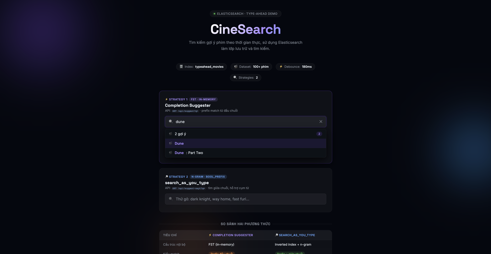
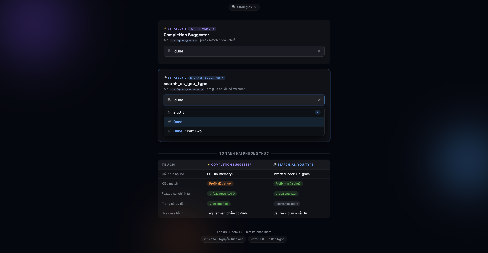
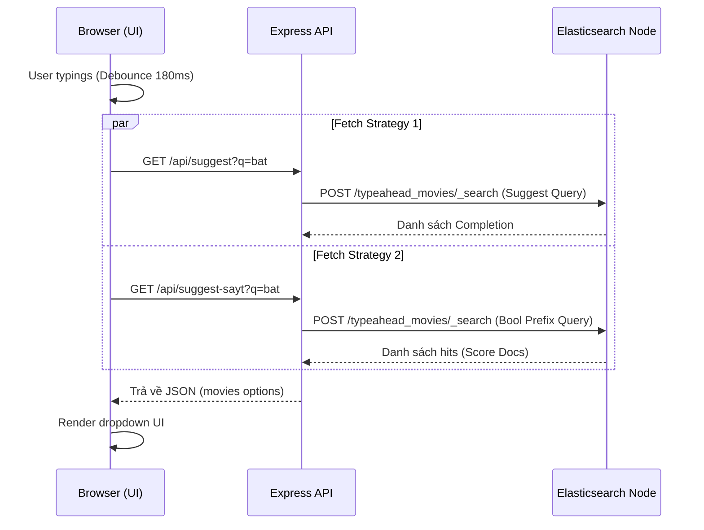

# Lab 08 - Elasticsearch and Typeahead

Nhóm 18
- 23127152 - Nguyễn Tuấn Anh
- 23127300 - Hà Bảo Ngọc

## 1. Hình ảnh ứng dụng (Screenshots)
Dưới đây là hình ảnh so sánh hai chiến lược gợi ý trực tiếp ngay khi người dùng gõ (Type-ahead):



## 2. Hướng dẫn chạy và sử dụng ứng dụng

Để có thể khởi chạy được server, máy tính cần cài sẵn **Node.js** và **Docker**. Thực hiện các bước sau:

**Bước 1: Khởi động Elasticsearch service**
Tại thư mục gốc, khởi chạy Elasticsearch thông qua Docker Compose (chạy ngầm).
```bash
docker-compose up -d
```

**Bước 2: Cài đặt dependencies**
```bash
npm install
```

**Bước 3: Khởi tạo dữ liệu (Seed)**
Tạo index và đưa mock-data của phim vào Elasticsearch.
```bash
npm run seed
```

**Bước 4: Khởi động server Web**
```bash
npm start
```
Truy cập ứng dụng tại `http://localhost:3000`. Người dùng nhập tên phim trên thanh tìm kiếm, ứng dụng áp dụng debounce `180ms` trên giao diện, sau đó tự động trả về hai danh sách gợi ý.

## 3. Cách thức Query hoạt động

Ứng dụng cài đặt hai strategy (Search 1 và Search 2) với Backend là Elasticsearch:

### 3.1. Strategy 1: Completion Suggester 
Sử dụng field `title` được define kiểu `completion` trong Elasticsearch mapping. Khi người dùng đánh chữ, query sẽ match với các tiền tố (prefix-match) từ đầu chuỗi văn bản.

```json
{
  "suggest": {
    "movie-suggest": {
      "prefix": "bat",
      "completion": {
        "field": "title",
        "size": 10,
        "fuzzy": { "fuzziness": "AUTO" }
      }
    }
  }
}
```

### 3.2. Strategy 2: search_as_you_type
Sử dụng field `title_sayt` định nghĩa kiểu dữ liệu `search_as_you_type`. Elasticsearch tự động phân tách dữ liệu ra làm các n-grams (2-gram, 3-gram). Khi gõ, query hoạt động qua `multi_match` với type là `bool_prefix`. Điều này cho phép tìm kiếm từ bất kỳ một phần nào của tên phim (cho phép match ở giữa chuỗi thay vì chỉ từ đầu rễ như Suggestion).



### 3.3 So Sánh Hai Chiến Lược Tìm Kiếm

Dưới đây là sự khác biệt giữa hai hướng đề xuất:

| Tiêu chí | Strategy 1: Completion Suggester | Strategy 2: `search_as_you_type` |
| :--- | :--- | :--- |
| **Cấu trúc dữ liệu nội bộ** | Đồ thị FST (Lưu trữ in-memory, tối ưu cực tốc độ) | Inverted Index kết hợp tự sinh N-gram |
| **Vị trí khớp chuỗi (Match Pattern)** | **Prefix Match** (Chỉ cho phép tra cứu khớp từ đầu văn bản) | **Anywhere Match** (Có khả năng tìm thấy các từ hoặc đoạn văn nằm giữa câu) |
| **Sửa lỗi chính tả (Typo/Fuzzy)** | Hỗ trợ Native rất tốt (Nhờ tham số cấu hình `fuzziness`) | Hỗ trợ qua Multi-match Analyzer |
| **Xếp hạng kết quả (Ranking)**| Hoạt động theo trọng số cố định đã gán sẵn trong tài liệu (`weight` mapping) | Xếp hạng theo độ liên quan (Relevance TF-IDF/BM25 Score) |
| **Ứng dụng (Use case)** | Tìm kiếm nhãn tag, gợi ý category gọn gàng hoặc hệ thống ưu tiên "speed-first" | Gợi ý các chuỗi văn bản dài, cụm từ chứa đa ngôn ngữ mà người dùng chỉ nhớ lõm bõm khúc giữa |

## 4. Tại sao cấu trúc Elasticsearch lại hoạt động tốt hơn?

1. **Hiệu suất cực kì cao (FST InMemory):** Thay vì full table scan như query `LIKE '%...%'` truyền thống trong RDBMS (SQL) với chi phí lên đến O(N) gây nghẽn ở hệ thống lớn. Completion suggester của ES tải các field được index vào bộ nhớ RAM và thiết lập chúng dưới dạng đồ thị cấu trúc **FST (Finite State Transducers)**. Cấu trúc này làm index nhỏ gọn nhưng tăng tốc độ truy vấn chỉ mất khoảng `O(1)` hoặc một vài milliseconds.
2. **Inverted Index và N-Grams:** Đối với search từ vị trí bất kì, ES dùng Inverted Index và chia văn bản thành các n-grams sẵn (vidu: "batman" -> "bat", "atm", "tma"...) giúp cho việc look-up keyword cực kỳ nhanh theo kiến trúc term -> document list mà RDBMS không có thế mạnh tích hợp sẵn.
3. **Relevance Scoring:** Elasticsearch tính toán sẵn tf-idf/BM25 weight để đưa ra các kết quả ranking hợp ngữ cảnh học và thông minh nhất.

## 5. Danh sách các lựa chọn công nghệ và lý do

### 5.1. Lựa chọn Framework: Express.js (Node.js)
- **Tùy chọn khác (Options):** Next.js, Nest.JS, Spring Boot, Koa...
- **Lý do chọn (Why):** Trong một ứng dụng demo và mô hình API server cực kỳ đơn giản (chỉ serve HTML tĩnh và hai REST endpoints), Express.js mang tính chất minimalistic, nhẹ nhàng, tốc độ triển khai lập trình rất nhanh, không đòi hỏi các boilerplates hay overhead configuration nào khác. Thiết lập Express phù hợp với một prototype đánh giá giải thuật.

### 5.2. Chọn Engine Tìm Kiếm: Elasticsearch
- **Tùy chọn khác (Options):** Redis (Sorted sets, Trie), PostgreSQL (LIKE / Regex), Algolia / Meilisearch...
- **Lý do chọn (Why):** PostgreSQL không có tính năng native fuzzy matching hiệu quả hoặc tự động n-gram ranking như mong đợi đối với auto-complete. Redis phản hồi rất nhanh nhưng lập trình viên phải tự implement thuật toán cấu trúc dữ liệu Trie hay thuật toán FST một cách rườm rà. Algolia là nền tảng cloud-hosted trả phí không đáp ứng tiêu chuẩn đồ án tự host. Elasticsearch thì trang bị đầy đủ công cụ Suggester / N-gram out-of-the-box, phù hợp trọn vẹn yêu cầu.

### 5.3. Các phương thức Type-ahead Strategy bên trong Elasticsearch
Khi quyết định tạo auto-complete trên Elasticsearch, có một số lựa chọn sau:
- **Prefix Query:** Phương pháp cơ bản tìm term theo hậu tố bắt đầu.
  - *Nhược điểm:* Chậm với tập dữ liệu lớn vì cần duyệt qua tất cả các terms phù hợp; không tối ưu hóa native cho fuzzy matching chuyên sâu.
- **Edge N-gram (Custom Analyzer):** Cấu hình analyzer tách text thành các n-grams nhỏ lúc lập index (ví dụ "bat" -> "b", "ba", "bat").
  - *Nhược điểm:* Kích thước Index phình ra vô cùng kích xù, rắc rối khi thiết lập mapping và cấu hình chuẩn cho từng chữ.
- **Lý do chọn 2 giải pháp hiện tại (Completion Suggester & search_as_you_type):** Đây là hai APIs đặc tả được sinh ra với mục tiêu phục vụ cho type-ahead/auto-complete. Completion Suggester sinh ra cấu trúc FST cho dữ liệu prefix với độ phản hồi cực đoan nhất (millisecond), trong khi `search_as_you_type` thì auto tự sinh các `2-gram`, `3-gram` ẩn kết hợp `bool_prefix` mang lại sự bao quát tìm kiếm N-gram mạnh mẽ không cần config dài dòng.

### 5.4. Tham số cấu hình Fuzzy (fuzziness: "AUTO")
Bên trong strategy "Completion Suggester", mã nguồn sử dụng:
```javascript
fuzzy: { fuzziness: "AUTO" }
```
- **Tùy chọn khác (Options):** Thiết lập con số cứng (Fixed edit distance) như `fuzziness: 1` hoặc `fuzziness: 2`.
- **Lý do chọn AUTO:** `AUTO` có khả năng tự động tính toán giá trị `edit distance (Khoảng cách Levenshtein)` được phép sai phạm dựa trên chiều dài chuỗi người dúng đánh:
  - Nếu số ký tự gõ vào < 3 ký tự: `fuzziness = 0` (Bắt buộc phải đúng hoàn toàn, tránh trả ra quá nhiều kết quả nhiễu/noise làm nặng payload).
  - Từ 3 tới 5 ký tự: `fuzziness = 1` (Được sai 1 ký tự).
  - Lớn hơn 5 ký tự: `fuzziness = 2` (Được sai tối đa 2 ký tự).
- Tham số này đảm bảo sự thích ứng và linh động tuyệt vời (adaptive approach), tạo ra trải nghiệm người dùng hoàn hảo: vừa chấp nhận lỗi đánh máy (typo tolerance) vừa tối ưu hiệu suất (performance) máy chủ mà không cần bận tâm viết logic kiểm tra (length checking) trong mã nguồn Node.js.

## 6. Tổng kết
Thông qua đồ án này, hệ thống Auto-complete/Type-ahead minh chứng được sức mạnh cốt lõi và thế mạnh tìm kiếm độc tôn của **Elasticsearch**. Bằng việc khai thác khôn khéo cấu trúc dữ liệu (đồ thị FST trong Completion Suggester và phân mảng n-gram trong Search As You Type), hệ thống không chỉ giải quyết bài toán độ trễ cực thấp trong full-text search, mà còn hỗ trợ native fuzzy matching – điều mà một cơ sở dữ liệu hệ quản trị quan hệ (RDBMS) tiêu tốn rất nhiều tài nguyên để đạt được. Kiến trúc tinh gọn với framework Express.js làm lớp trung gian (API Gateway) mang đến một bản demo trực quan, đáng tin cậy và có tiềm năng scale up dễ dàng trong thực tế.
